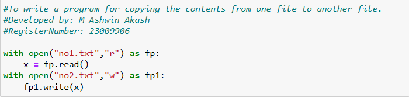

# copy-file
## AIM:
To write a python program for copying the contents from one file to another file.
## EQUIPEMENT'S REQUIRED: 
PC
Anaconda - Python 3.7
## ALGORITHM: 
<br>
 Step 1: Get the file name and location from the user.
<br>
Step 2: Give a new file name to create a copy of a file content.
<br>
Step 3: Read the file and close the file.
<br>
Step 4: Now write the content in the new file.
<br>
Step 5: When done print"File copied successfully".
<br>
Step 6: End of the program

### PROGRAM:
```
#To write a program for copying the contents from one file to another file.
#Developed by: M Ashwin Akash
#RegisterNumber: 23009906
with open("no1.txt","r") as fp: 
    x = fp.read()
with open("no2.txt","w") as fp1: 
    fp1.write(x)
```
### OUTPUT:

.png)
.png)
## RESULT:
Thus the program is written to copy the contents from one file to another file.